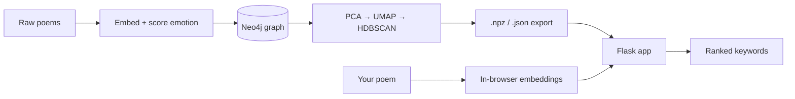

<p align="center">
  
</p>

<h1 align="center">Project Epithet</h1>

> **Discover the words that define your writing.**

Project Epithet compares your poetry against a [corpus of public domain poetry](https://huggingface.co/datasets/DanFosing/public-domain-poetry) and surfaces the words and emotional tones your writing most closely resembles. Your poem is embedded entirely in your browser — the raw text never leaves your device, only the resulting vectors are sent to the server.

## Table of Contents

- [Quick Start](#quick-start)
- [How It Works](#how-it-works)
- [Tech Stack](#tech-stack)
- [File Structure](#file-structure)

## Quick Start

The project is split across two branches with different jobs. **`dev`** has the full pipeline (Neo4j, dataset generation, the app) and is where you build the dataset locally. **`main`** is the production server — it only runs the app, and never touches Neo4j or the pipeline at all.

**1. Create a `.env`** in the repo root. The two branches need different variables, since `main` has no Neo4j service to configure:

`dev`:
```env
COMPOSE_PROJECT_NAME=project_epithet
NEO4J_URI=bolt://localhost:7687
NEO4J_USER=neo4j
NEO4J_PASSWORD=choose_a_password
DATA_DIR="data"
```

`main`:
```env
COMPOSE_PROJECT_NAME=project_epithet
```

> `NEO4J_URI`/`DATA_DIR` are only read at all if you run scripts directly on the host; Compose sets its own values for containers.

**2. Build the dataset, on `dev`** (only needs to be done once, or whenever the source poems or pipeline parameters change):

```bash
git checkout dev
docker compose run --rm build-database     # ingest poems into Neo4j
docker compose run --rm generate-dataset   # cluster + export the dataset
docker compose stop neo4j                  # no longer needed once this is done
```

Each stage skips itself if its output files already exist — delete them to force a re-run.

**3. Move the generated files to the server.** Only these are needed at runtime — everything else in `data/` (`raw/`, `models/`, `semi-processed/`) is pipeline-only and can stay on `dev`:

```
data/processed/master_embeddings.npy
data/processed/metadata.json
data/processed/clustered_data.npz
data/config/emotional-anchor.json
```

There's no automated sync yet — copy them over by hand (e.g. dragging files between a local and a Remote-SSH VS Code tab, or `scp`/`rsync`).

**4. Launch the app**, on the branch matching your target:

| | `dev` | `main` |
|---|---|---|
| Command | `docker compose up app` (or `--watch` to live-reload) | `docker compose up -d app` |
| Served by | Flask dev server, debug mode, host networking | Gunicorn, bound to `127.0.0.1:5000` only |
| Reachable at | `http://localhost:5000` | Behind a reverse proxy (Nginx/Caddy) — not exposed directly |

> **Branching:** `compose.yaml` deliberately differs between branches (`main`'s has no Neo4j/pipeline services at all). `.gitattributes` marks it `merge=ours`, so a normal `git merge dev` keeps `main`'s version of that file automatically instead of taking `dev`'s. This only works after running, once per clone:
> ```bash
> git config merge.ours.driver true
> ```
> Without that config, git silently merges the file normally — so don't assume it's protected on a fresh clone or CI runner until it's set.

## How It Works



**Building the dataset** (`pipeline/`, run once):
- Poems are split into line-sized chunks, embedded with SentenceTransformers, and scored against a set of hand-defined "emotion anchors" (`data/config/emotional-anchor.json`); chunks with no clear emotional signal are dropped.
- spaCy extracts lemmatized keywords (nouns, verbs, adjectives, adverbs) from the surviving lines, each colored by blending the hex colors of its strongest matching emotions.
- Everything is loaded into Neo4j as `Author → Line → Keyword` nodes, then pruned of rare keywords and orphaned lines. Keywords get an inverse-frequency score marking how rare they are.
- Line embeddings are extracted back out of Neo4j and clustered with PCA → UMAP → HDBSCAN, and the result is exported as compressed files so the running app never needs Neo4j.

**Serving requests** (`app/`, always running):
- Your poem is chunked and embedded in the browser (via Transformers.js, the same model used server-side), so the raw text is never transmitted.
- The Flask backend (`main.py`) queues requests one at a time behind a thread lock, since scoring is CPU-heavy — clients poll `/api/queue/status` and submit once they're at the front.
- `engine.py` compares your poem's embeddings against the corpus by cosine similarity to find nearby clusters ("neighborhoods"), ranks those neighborhoods by hit count, similarity, and cluster size, then scores keywords in the top neighborhoods by a weighted blend of semantic and emotional closeness. The weighting is adjustable from the Settings dialog in the UI.
- Corpus metadata is read from disk by line offset rather than loaded into memory, so the app can run without much RAM.

## Tech Stack

| Area | Technology |
|---|---|
| Pipeline | Python, Neo4j, SentenceTransformers (`all-MiniLM-L6-v2`), spaCy, better-profanity, scikit-learn (PCA), UMAP, HDBSCAN, joblib |
| App backend | Flask (dev) / Gunicorn (production), scikit-learn (cosine similarity), NumPy `memmap` |
| App frontend | Vanilla JS, [Transformers.js](https://github.com/xenova/transformers.js) (`Xenova/all-MiniLM-L6-v2`) for in-browser embeddings |

## File Structure

```text
.
├── compose.yaml
├── pipeline/                  # Build the dataset (Neo4j + ML), run once
│   ├── build_database.py
│   ├── generate_dataset.py
│   └── parameters.py / parameters_local.py
├── app/                       # The running Flask application
│   ├── main.py                 # server, API routes, request queue
│   ├── engine.py               # keyword search & scoring
│   ├── parameters.py / parameters_local.py
│   ├── templates/index.html
│   └── static/
│       ├── css/style.css
│       ├── favicons/
│       └── js/
│           ├── ui-controller.js   # UI state, results rendering
│           ├── pipeline.js        # chunking + queue submission
│           └── vector-engine.js   # in-browser embeddings (Transformers.js)
└── data/                       # Shared between pipeline and app
    ├── raw/poems.json
    ├── config/emotional-anchor.json
    ├── models/                 # trained PCA/UMAP/HDBSCAN (.joblib)
    └── processed/
        ├── clustered_data.npz
        ├── master_embeddings.npy   # raw float32, no NumPy header — read with memmap, not np.load
        └── metadata.json            # one JSON line per corpus line
```

> `parameters.py` is duplicated between `pipeline/` and `app/` — shared values (embedding dimension, data paths, etc.) must stay in sync, or the app will misread the generated dataset.
>
> `master_embeddings.npy`, `metadata.json`, and the cluster labels in `clustered_data.npz` are all aligned by row index — they must always be regenerated together.
