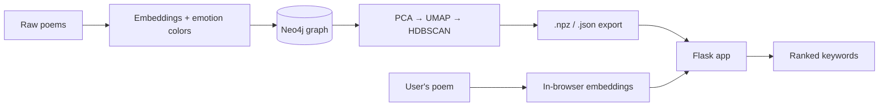

<p align="center">
  
</p>

<h1 align="center">Project Epithet</h1>

> **Discover the words that define your writing.**

Project Epithet is a graph-based NLP engine that describes you through your writing and compares you to others.

It takes your personal poetry and compares it against a large database of classical works. By extracting semantically significant and emotionally charged words from a [public domain poetry corpus](https://huggingface.co/datasets/DanFosing/public-domain-poetry), the engine finds the specific terms that resonate most closely with your style, showing you the historical lexicon your writing naturally aligns with.

Your poem is embedded entirely in your browser: the raw text never leaves your device, and only the resulting numerical vectors are sent to the server.

## Table of Contents

- [System Architecture](#system-architecture)
  - [Phase 1: The Knowledge Graph Pipeline](#phase-1-the-knowledge-graph-pipeline)
  - [Phase 2: The Local Application](#phase-2-the-local-application)
- [User Interface](#user-interface)
- [Tech Stack](#tech-stack)
- [File Structure](#file-structure)
- [Running the Project](#running-the-project)

## System Architecture

The project is split into two halves:

1. **A heavy data processing pipeline** that runs once to build the database.
2. **A lightweight, highly optimized local application** that the user interacts with.



### Phase 1: The Knowledge Graph Pipeline

This backend pipeline turns a large corpus of raw public domain poetry (millions of lines) into a structured, searchable, and mathematically clustered space.

| Stage | What it does |
|---|---|
| **Chunking** | The title and text of each poem are split into lines. Very long lines are split at punctuation or spaces, and short lines are merged together so every chunk gives the embedding model enough context. |
| **Emotion Scoring** | SentenceTransformers embeds each chunk and compares it against per-emotion "anchors" defined in `emotional-anchor.json` (centroid vectors built from each emotion's anchor lines and words, minus any "exclude" phrases). Chunks with no strong emotional signal are discarded. |
| **Keyword Parsing** | spaCy extracts lemmatized nouns, verbs, adjectives, and adverbs, filtering out stop-words and profanity. A word is kept only if, for at least one emotion, both the word and its line clear the emotion thresholds. |
| **Color Blending** | Each kept word gets a hex color blended from the colors of its top four emotions (weighted by strength, with `Neutral` excluded). Colors are mixed in HSV space, with hue averaged circularly so blends stay vibrant. |
| **Graph Ingestion** | Loads data into Neo4j as `Author`, `Line`, and `PoemKeyword` nodes, linked as `(Author)-[:AUTHORED]->(Line)-[:HAS_KEYWORD]->(PoemKeyword)`. Ingestion uses `MERGE`, so it is safe to re-run. Afterwards the pipeline deletes rare keywords (at or below a frequency threshold), deletes lines left without keywords, and gives every keyword an `inverseFrequency` score (an IDF-style measure of how rare it is). |
| **Clustering & Dimensionality Reduction** | Line embeddings and metadata are streamed out of Neo4j in batches. If the embeddings are projected to need 4 GB or more, they are written to a disk-backed memory map instead of RAM. **PCA → UMAP → HDBSCAN** are fitted on a random sample, then the full dataset is transformed in batches and assigned to clusters ("neighborhoods") with HDBSCAN's approximate prediction. |
| **Lightweight Export** | Writes the embeddings, per-line metadata, and cluster data to compressed or flat files, completely decoupling the app from Neo4j (see [`/data`](#data--shared-storage)). |

### Phase 2: The Local Application

The user-facing application queries the dataset created in Phase 1 without needing a running Neo4j instance and without loading the full metadata file into RAM. It is also privacy-preserving by design: your poem's text is never transmitted or stored, only the embeddings computed from it.

#### User Interface & Interaction

The frontend HTML defines the application's visual structure. `ui-controller.js` is the primary UI orchestrator: it handles user input, payload management, and the asynchronous polling mechanism that communicates with the backend queue.

#### Client-Side NLP Processing

`pipeline.js` chunks and reflows the user's input poem using the same line-splitting and recombination logic as the pipeline (see [Chunking](#phase-1-the-knowledge-graph-pipeline) above), then hands each line to `vector-engine.js`. That module loads [Transformers.js](https://github.com/xenova/transformers.js) from a CDN and runs `Xenova/all-MiniLM-L6-v2` — a browser-compatible build of the same model the pipeline uses server-side — so the resulting vectors are directly comparable to the master embeddings. Only these vectors are sent to the server; the raw poem text is not.

#### Thread-Safe Queueing System

The Flask backend (`main.py`) uses a custom ticket-based queue guarded by a `threading.Lock` (`queue_lock`). A client joins the queue, polls for its position, and may only submit its poem once it reaches the front, so only one heavy vector comparison runs at a time. Tickets that stop polling for more than 10 seconds are dropped, and a ticket stuck in processing for more than 5 minutes is cleared.

| Route | Purpose |
|---|---|
| `GET /`, `GET /results` | Serve the UI. |
| `POST /api/queue/join` | Join the queue and receive a ticket ID and position. |
| `GET /api/queue/status/<ticket_id>` | Poll for queue position. Returns `ready` at position 0, or `expired` (404) if the ticket was dropped. |
| `POST /api/queue/process` | Submit embeddings and settings. Only accepted when the ticket is at the front of the queue. Returns the ranked keywords. |

Request bodies are limited to 8 MB.

#### Disk-Backed Metadata Indexing

Instead of loading the metadata file (one JSON record per line) into RAM, a `MetadataReader` builds a compact NumPy array of line byte-offsets on boot (roughly 16 MB for about 2 million lines). When the engine needs specific lines, it seeks directly to their byte offsets and reads only those. Master embeddings are opened with `np.memmap` rather than loaded up front.

#### Algorithmic Keyword Scoring

The server (`engine.py`) turns your poem into ranked keywords in four steps:

1. **Find neighbors.** Each chunk of your poem (embedded in the browser) is compared to every master line by cosine similarity. The nearest matches tell the engine which HDBSCAN neighborhoods the chunk falls into; noise points (cluster `-1`) are ignored. Each chunk is also scored against the emotion anchors.
2. **Rank neighborhoods.** Neighborhoods are scored using the number and similarity of matching chunks, with a size penalty to prevent very large clusters from dominating. Only the highest-ranked neighborhoods are kept.
3. **Pull lines.** Every master line in those neighborhoods is read from disk via the `MetadataReader`.
4. **Score keywords.** Each keyword is ranked using a weighted blend of:
   - **Semantic Closeness:** how similar your poem is to the keyword's neighborhood (the mean similarity of your matched chunks, scaled across neighborhoods).
   - **Emotional Closeness:** how close the emotion-score vectors of the word *and* its line are to the neighborhood's emotional profile (the average emotion scores of your chunks that landed there), measured as `1 / (1 + distance)`.

   Each word keeps its best score across all lines, and the top results are returned.

The blend is adjustable through the Settings dialog. The available controls let you change the balance between semantic and emotional similarity, the relative contribution of line and word emotion, the amount of search context, the number of neighborhoods considered, and the number of results returned.

Presets provide convenient combinations of these settings for different interpretation styles.

## User Interface

A single Flask template (`templates/index.html`) renders both the submission form and the results page, styled by `static/css/style.css` in a dark, book-like theme.

- **Submission form:** a name/title field (optional, used only as a display label) and a textarea for the poem, with a live character counter.
- **Info dialog:** explains the project and links to the [source poetry corpus](https://huggingface.co/datasets/DanFosing/public-domain-poetry).
- **Settings dialog:** provides controls for adjusting the keyword scoring and search behavior, along with presets for quickly switching between different configurations. Settings and form inputs persist in `localStorage`, so they survive a page reload.
- **Submission flow:** the button label walks through Loading Engine → Joining Queue → (In Queue: Spot #N, if applicable) → Processing Data → Complete, reflecting the client-side embedding step and the server-side queue described under [Client-Side NLP Processing](#client-side-nlp-processing) and [Thread-Safe Queueing System](#thread-safe-queueing-system).
- **Results page:** each returned keyword is rendered as a card colored with its blended emotion hex code, showing its match percentage (its similarity score) and a rarity label derived from `inverseFrequency` (Very common / Common / Rare / Very rare).

## Tech Stack

### Data Pipeline & Machine Learning (Phase 1)

| Technology | Role |
|---|---|
| **Python 3.x** | Core pipeline logic |
| **Neo4j & Cypher** | Graph database for relationship mapping, frequency-based pruning, and inverse-frequency scoring |
| **SentenceTransformers** (`all-MiniLM-L6-v2`) | Dense vector embedding generation |
| **spaCy** | Part-of-speech tagging and lemmatization for keyword extraction |
| **better-profanity** | Profanity filtering for keywords |
| **scikit-learn (PCA), UMAP, HDBSCAN** | Dimensionality reduction and semantic clustering |
| **NumPy & PyTorch** | Tensor operations and matrix math |
| **joblib** | Saving the trained PCA, UMAP, and HDBSCAN models |

### Local Web Application (Phase 2)

| Technology | Role |
|---|---|
| **Flask** | Lightweight Python web server and API routing |
| **Gunicorn** | Production WSGI server used on the deployed server |
| **Frontend HTML** | UI structure and data visualization containers |
| **JavaScript** (vanilla / ES6) | Client-side application logic, polling, and DOM state management |
| **[Transformers.js](https://github.com/xenova/transformers.js)** (`Xenova/all-MiniLM-L6-v2`) | In-browser embedding generation, loaded from a CDN so the poem text never leaves the browser |
| **SentenceTransformers & PyTorch** | Server-side, used at startup to build the emotion anchor vectors |
| **scikit-learn** | Cosine similarity between your poem and the master embeddings |
| **NumPy (`memmap`)** | High-performance, disk-backed array access for massive datasets |

## File Structure

The repository strictly separates the heavy data processing pipeline from the lightweight local web application.

```text
.
├── compose.yaml
├── .env
├── .gitignore
├── .pre-commit-config.yaml
├── .prettierrc
├── README.md
├── pipeline/                  # Phase 1: Knowledge Graph & ML
│   ├── .dockerignore
│   ├── Dockerfile
│   ├── requirements.txt
│   ├── build_database.py
│   ├── generate_dataset.py
│   ├── parameters.py
│   └── parameters_local.py
├── app/                       # Phase 2: Local Application
│   ├── .dockerignore
│   ├── Dockerfile
│   ├── requirements.txt
│   ├── main.py
│   ├── engine.py
│   ├── parameters.py
│   ├── parameters_local.py
│   ├── templates/
│   │   └── index.html
│   └── static/
│       ├── css/
│       │   └── style.css
│       ├── favicons/
│       │   ├── favicon.ico
│       │   ├── favicon-16x16.png
│       │   ├── favicon-32x32.png
│       │   ├── apple-touch-icon.png
│       │   └── site.webmanifest
│       └── js/
│           ├── ui-controller.js
│           ├── pipeline.js
│           └── vector-engine.js
└── data/                      # Shared storage
    ├── raw/
    │   └── poems.json
    ├── semi-processed/
    ├── config/
    │   └── emotional-anchor.json
    ├── models/
    │   ├── pca_model.joblib
    │   ├── umap_model.joblib
    │   └── hdbscan_model.joblib
    └── processed/
        ├── clustered_data.npz
        ├── master_embeddings.npy
        └── metadata.json
```

### `/pipeline` — Phase 1: Knowledge Graph & ML

Heavy backend scripts that process the raw data, build the Neo4j graph, and train the machine learning models.

| File | Purpose |
|---|---|
| `build_database.py` | Part 1 of Phase 1. Chunks the raw poetry, scores emotions, extracts keywords, and ingests everything into Neo4j, then prunes rare keywords and orphaned lines and adds inverse-frequency scores. |
| `generate_dataset.py` | Part 2 of Phase 1. Extracts embeddings and metadata from Neo4j, trains PCA/UMAP/HDBSCAN on a sample, assigns every line to a cluster, and exports the final lightweight datasets. Each stage is skipped if its output already exists. |
| `parameters.py` / `parameters_local.py` | Configuration files for tweaking NLP and pipeline settings. Shared values must stay consistent with the app's copy (see below). |
| `requirements.txt` | Python dependencies for the pipeline image. |
| `Dockerfile` / `.dockerignore` | Container image for the pipeline scripts. `compose.yaml` in the repo root wires it together with Neo4j. |

### `/app` — Phase 2: Local Application

The lightweight Flask backend and vanilla JavaScript frontend that the user interacts with.

| File | Purpose |
|---|---|
| `main.py` | Flask server entry point, API routes, and the ticket-based request queue. |
| `engine.py` | Backend extraction engine: `MetadataReader` (disk-backed metadata indexing) and `PoemKeywordExtractor` (neighborhood search and keyword scoring). |
| `parameters.py` / `parameters_local.py` | Configuration for the app. Values the app shares with the pipeline (such as the embedding dimension, emotion attenuation settings, and data paths) **must match `pipeline/parameters.py`**, or the app will misread the generated dataset. |
| `requirements.txt` | Python dependencies for the app image. |
| `Dockerfile` / `.dockerignore` | Container image for the Flask app. |
| `templates/index.html` | Main user interface structure. |
| `static/css/style.css` | Application styling. |
| `static/favicons/` | Site icons: `favicon.ico`, 16×16/32×32 PNGs, an Apple touch icon, and `site.webmanifest`. |
| `static/js/ui-controller.js` | Manages UI state, user inputs, and asynchronous polling to the backend queue. |
| `static/js/pipeline.js` | Client-side NLP workflow: chunks text and prepares payloads for the backend. |
| `static/js/vector-engine.js` | Sub-component used by `pipeline.js`, solely responsible for generating vector embeddings for poems in the browser. |

### `/data` — Shared Storage

Where raw inputs, trained models, and final optimized outputs are kept.

| Path | Purpose |
|---|---|
| `raw/poems.json` | Initial raw dataset of public domain poetry: a JSON list of poems with `Author`, `Title`, and `text` fields. |
| `semi-processed/` | Intermediate files produced between the raw data and the final processed output. |
| `config/emotional-anchor.json` | Defines each emotion's anchor `lines`, `words`, optional `excludes`, and hex `color`. The emotion vectors are computed from these at startup (by both the pipeline and the app), and the colors are used to blend word colors. |
| `models/` | Saved PCA, UMAP, and HDBSCAN models (`pca_model.joblib`, `umap_model.joblib`, `hdbscan_model.joblib`) used for semantic clustering. |
| `processed/clustered_data.npz` | Compressed UMAP coordinates and HDBSCAN cluster labels (the app currently reads only the labels). |
| `processed/master_embeddings.npy` | Raw `float32` line embeddings, read with `np.memmap`. Despite the extension it has no NumPy header, so it can't be opened with `np.load`. |
| `processed/metadata.json` | Newline-delimited JSON, one record per line: the line text, its per-emotion scores, and its keywords (word, color, per-emotion scores, `inverseFrequency`). Read by byte offset. |

> **Important:** the rows in `master_embeddings.npy`, `metadata.json`, and the cluster labels in `clustered_data.npz` are aligned by index. Line *i* in one file is line *i* in the others, so they must always be generated together.

## Running the Project

The project is fully containerized with Docker Compose. `compose.yaml` defines four services:

| Service | Purpose |
|---|---|
| `neo4j` | Neo4j 5.26 Community graph database (browser on port `7474`, Bolt on `7687`). Data persists in the `neo4j_data` volume. |
| `build-database` | Runs `build_database.py` (Phase 1, Part 1). |
| `generate-dataset` | Runs `generate_dataset.py` (Phase 1, Part 2). |
| `app` | Runs the Flask web application (Phase 2). |

### 1. Configure your environment

Create a `.env` file in the root directory:

```env
NEO4J_USER=neo4j
NEO4J_PASSWORD=your_secure_password
```

### 2. Build the database

Starts Neo4j (waiting for its healthcheck to pass) and ingests the raw poems into the graph. Ingestion uses `MERGE`, so it is safe to re-run if it is interrupted:

```bash
docker compose run --rm build-database
```

### 3. Generate the dataset

Streams the data out of Neo4j, trains PCA → UMAP → HDBSCAN, clusters every line, and writes the output files to `data/processed/`:

```bash
docker compose run --rm generate-dataset
```

Each stage is skipped if its output already exists (`master_embeddings.npy` and `metadata.json` for extraction, the three files in `data/models/` for training, and `clustered_data.npz` for prediction). To redo a stage, delete its output files first. If you retrain the models, also delete `clustered_data.npz` so the clusters are re-predicted.

Once this finishes you no longer need Neo4j, so you can shut it down:

```bash
docker compose stop neo4j
```

### 4. Launch the app

The app runs differently in development and in production, and each setup lives on its own branch: `dev` for development and `main` for the production server. Check out the branch that matches your setup.

| | Development | Production (server) |
|---|---|---|
| **Branch** | `dev` | `main` |
| **Command** | `python main.py` (Flask, debug mode) | `gunicorn --bind 0.0.0.0:5000 --workers 1 --threads 4 main:app` |
| **Networking** | Host network mode | Standard Docker networking |
| **Exposed at** | `http://localhost:5000` | `127.0.0.1:5000` (this machine only) |
| **Public access** | Direct | Through a reverse proxy |

#### Development

```bash
git checkout dev
docker compose up app
```

Then open <http://localhost:5000>. To sync changes in `./app` into the container automatically (and rebuild when `app/requirements.txt` changes), use:

```bash
docker compose up --watch app
```

> **Note:** Host networking is only fully supported on Linux. On Docker Desktop for Mac or Windows it behaves differently, so `localhost:5000` may not be reachable.

#### Production

```bash
git checkout main
docker compose up -d app
```

The app is served by Gunicorn with a single worker and four threads, and it restarts automatically unless stopped (`restart: unless-stopped`). It is published only on `127.0.0.1:5000`, so it is **not reachable from outside the server**. To serve it publicly, put a reverse proxy such as Nginx or Caddy in front of it and forward requests to `http://127.0.0.1:5000`.

> **Security:** Neo4j publishes ports `7474` and `7687` on all interfaces. Once you've generated the dataset (step 3), stop it with `docker compose stop neo4j`, or restrict those ports to `127.0.0.1` in `compose.yaml`. The app doesn't need Neo4j at runtime.

> **Note:** Steps 2 and 3 only need to be run once (or whenever you change the dataset or pipeline parameters). The `data/` directory is mounted into every container, so the outputs are shared with the app.
