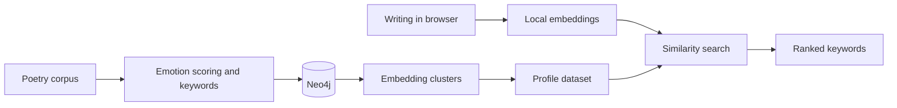

<p align="center">
  
</p>

<h1 align="center">Project Epithet</h1>

<p align="center"><em>The words that define you.</em></p>

Project Epithet explores the language and emotional tones in your writing—poems, lyrics, prose, and more—by comparing it with a corpus of [public-domain poems](https://huggingface.co/datasets/DanFosing/public-domain-poetry). It uses emotion-aware analysis and in-browser text embeddings to find related contexts and surface their defining keywords, without sending your text to the server.

Profiles shape how those connections are interpreted. Some focus on a broad spectrum of emotions; others offer playful, fandom-inspired comparisons, such as which character a piece of writing most resembles. They’re creative lenses for exploring style, not definitive labels.

## Table of Contents

- [Quick Start](#quick-start)
- [How It Works](#how-it-works)
- [Tech Stack](#tech-stack)
- [File Structure](#file-structure)

## Quick Start

Use the `dev` branch to build datasets and run the app locally. You’ll need Docker Compose, PowerShell, and the source poetry corpus.

1. Copy `templates/.env.example` to `.env` and fill in the settings for your local setup.
2. Put the corpus at `data/raw/poems.json`, then create a profile and edit its emotion and dataset settings:

   ```powershell
   .\manage.ps1 add-new-profile my-profile -Open
   ```

3. Build the profile’s dataset. This command resets Neo4j and creates a fresh database; confirm the prompt to proceed:

   ```powershell
   .\manage.ps1 build-and-generate my-profile -Delete
   ```

   The pipeline runs in the background. Follow the container logs shown by the script and wait for it to finish.

4. Start the app locally:

   ```powershell
   docker compose up --watch app
   ```

   To run the app on a remote VM, first configure VM access and upload the prepared profile:

   ```powershell
   .\manage.ps1 upload-data profiles\my-profile profiles\my-profile
   ```

   The destination is relative to the VM’s data directory, and its parent directory must already exist. The `main` branch runs the app against prepared profiles; dataset building stays on `dev`.

For other management commands and options, run `.\manage.ps1 help`.

## How It Works



- The pipeline scores poem lines and keywords against a profile’s emotion anchors, then groups line embeddings into semantic clusters.
- The browser turns your text into embeddings locally and sends those, along with your search settings, to the Flask app—not the text itself. The corpus is poetry, but lyrics, prose, and other writing can also be explored.
- The app finds related clusters and ranks their keywords by semantic and emotional similarity. Each profile has its own configuration and generated dataset.

## Tech Stack

| Area | Technology |
|---|---|
| Pipeline | Python, Neo4j, SentenceTransformers, spaCy, scikit-learn, UMAP, HDBSCAN |
| App backend | Flask, NumPy |
| App frontend | JavaScript, Transformers.js |

## File Structure

```text
.
├── app/                 # Flask API and browser app
├── pipeline/            # Corpus ingestion and dataset generation
├── templates/
│   └── profile/         # Starter profile configuration
├── compose.yaml
└── manage.ps1           # Profile and pipeline commands
```

### Data layout

```text
data/
├── profiles/             # Profile configs and datasets; used by the app on main
│   └── <profile>/
│       ├── config/
│       └── processed/
├── raw/                  # Source corpus for building datasets on dev
└── temporary/            # Intermediate pipeline files on dev
```

Build datasets on `dev`, then transfer the profile data needed by the app on `main`. The corpus and generated datasets are local and are not tracked in Git.
